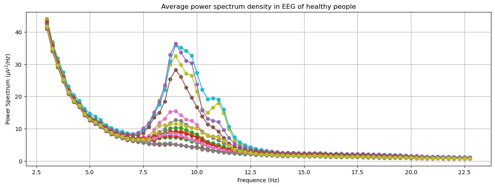
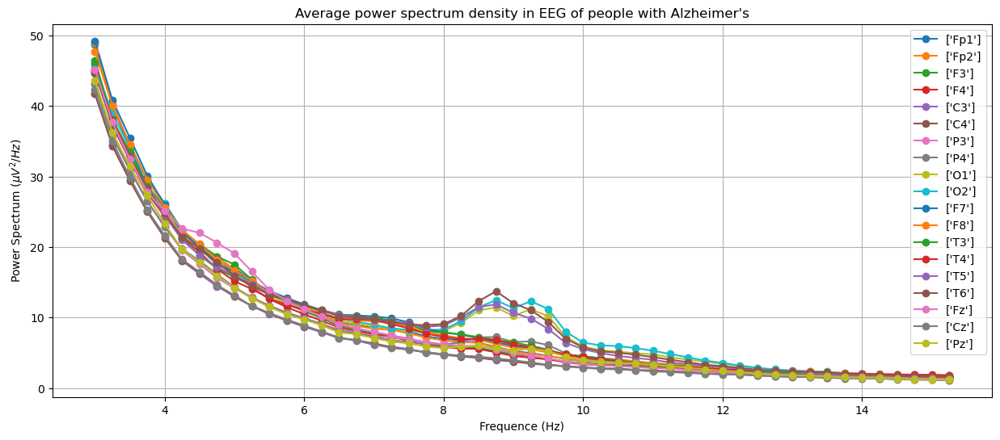

# Demential Detection Tool
 Alzheimer's and Frontotemporal Dementia are neurogenerative disorders and are among the most common types of Dementia. Electroencephalography (EEG), which is an non invasive technique to measure the electrical activity in brain using external electrodes, may provide improved diagnosis of the disease. In this project, we evaluate and compare various machine learning models for this classification problem. 

## Usefulness of EEG for Alzheimer's and dementia detection.
To see that EEG is a useful tool to diagnose dementia, here we show plots of power spectrum density obtained from EEG of different groups: Alzheimer's, frontotemporal dementia and healthy people. The plots were generated by averaging over people within the groups. 

## How to navigate this repository

1) All the pre-processing function necessary to get the input and output data in correct format: [processing_functions.py](https://github.com/HimanshuKhanchandani/Demential-Detection-Tool/blob/main/processing_functions.py).
2) All the baseline classification models: [classification_models.py](https://github.com/HimanshuKhanchandani/Demential-Detection-Tool/blob/main/classification_models.py).
3) Demonstration of classification performancer of the baseline models: [classification_performances.ipynb](https://github.com/HimanshuKhanchandani/Demential-Detection-Tool/blob/main/classification_performances.ipynb).
 
 ### Dependencies
 You need to have MNE package installed to read and work with EEG data in python. 
 The dataset for the project can be found on https://github.com/OpenNeuroDatasets/ds004504/tree/main and may be downloaded using datalad. If you are new to datalad, like I was, following tutorial may be helpful (https://psychoinformatics-de.github.io/rdm-course/aio/index.html). Once you download the data in your favorite location, put that location into config.
