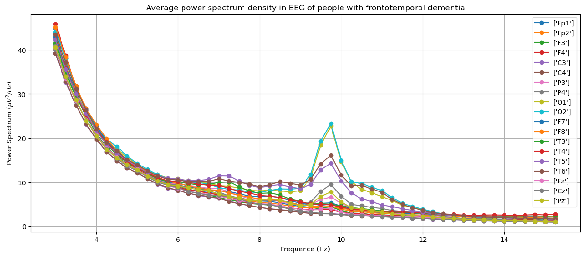
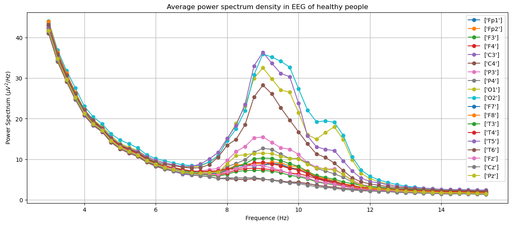

# Dementia Detection Tool
Erdos Institute fall 2023 data science bootcamp
## Team members: 
- [Himanshu Khanchandani](https://www.linkedin.com/in/himanshu-khanchandani-5b2b8675/)
- [Clark Butler](https://www.linkedin.com/in/clark-butler-608446247/)
- [Çisil Karagüzel](https://www.linkedin.com/in/%C3%A7isil-k-886253155/)
- [Selman Ipek](https://www.linkedin.com/in/selman-ipek-12421613a/)
- [Shreya Shukla](https://www.linkedin.com/in/shreya-shukla-uci/)

## Overview
 Alzheimer's and Frontotemporal Dementia are neurogenerative disorders and are among the most common types of Dementia. Electroencephalography (EEG), which is an non invasive technique to measure the electrical activity in brain using external electrodes, may provide improved diagnosis of the disease. In this project, we evaluate and compare various machine learning models for this classification problem. 
## Use cases
A machine learning based classifier for Alzheimer's and frontotemporal demential will be extremely useful in hospital and lab settings to screen patients before subjecting them to more invasive treatments or tests.  
## Dataset description
The dataset for the project can be found on https://github.com/OpenNeuroDatasets/ds004504/tree/main and may be downloaded using datalad. If you are new to datalad, like I was, following tutorial may be helpful (https://psychoinformatics-de.github.io/rdm-course/aio/index.html). 

The data consists of resting state eyes closed EEG of 88 subjects out of which 36 have Alzheimer's, 23 have frontotemporal dementia and the other 29 are healthy subjects. The EEG was recorded from 19 scalp electrodes for 10- 13 min for each subject with a sampling frequency of 500 Hz, and is available as a .set file. 
 ## Dependencies
 Following packages need to be installed: 
 ```
MNE-Python, Scikit-Learn, Numpy, Scipy, Pickle, Pandas, Matplotlib, JSON
```

## Usefulness of EEG for Alzheimer's and dementia detection.
To see that EEG is a useful tool to diagnose dementia, here we show plots of power spectrum density obtained from EEG of different groups: Alzheimer's, frontotemporal dementia and healthy people. The plots were generated by averaging over people within the groups. 





## How to navigate this repository
1) All the relevant modeling and data processing happens inside the models folder. 
2) Once you download the data in your favorite location, put that location into [config.py](models/config.py) within the models folder, and that should make all the other scripts access the data easily. Also create and then specify the location of the processed data folder in config.py file, so that when you can run the relevant code, it will store the processed data.
3) All the pre-processing function necessary to get the input and output data in correct format: [model_functions.py](models/model_functions.py).
4) Data visualization and exploratory data analysis: [DataVisualization.ipynb](models/DataVisualization.ipynb) 
5) Functions for all the classification models we tried: [Classification_models_functions_LOSO_2Class.py]([https://github.com/HimanshuKhanchandani/Demential-Detection-Tool/blob/main/models/Classification_models_LOSO_2Class.py](models/Classification_models_functions_LOSO_2Class.py))
6) Cross-validation of classification models: [Classification_cross_validation.ipynb]([models/Classification_cross_validation.ipynb))
7) Training the final chosen model on all the train data and saving for the web app: [Final_ADHealthy_model_save.ipynb](models/Final_ADHealthy_model_save.ipynb).

## Features and model used
For a summary of our feature and model selection process, look at our [presentation slides](Erdos_Presentation_slides.pdf). But here is a brief summary: 

We divide the EEG of each subject into smaller epochs of 2 minutes each with fifty percent overlap amongst epochs. This gives us a final training dataset with 702 data points. The features consist of power spectrum of each epoch in each channel integrated over six frequency bands namely : (0.5- 4 Hz), (4.0 - 7.0 Hz), (7.0 - 9.0 Hz), (11.0- 13.0 Hz), (13.0 - 25.0 Hz). To be more precise, the features are relative band powers in these frequency bands. And we use 15 out of the original 19 channels, so there are in total 90 features (15 channels for six frequency bands).

After cross-validation, we chose a support vector machine classifier, with a linear kernel and a regularization parameter 1.21, as the msot accurate model which achieved a cross-validation accuracy of 89%. 
 

 ## Applying the model
We have hosted the trained model on a web-based app on [Hugging Face](https://huggingface.co/spaces/HKhanchandani/Dementia_detection_tool).

